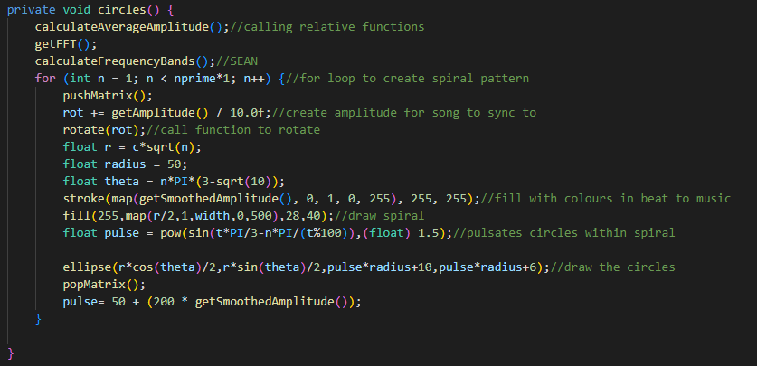

# Music Visualiser Project

Names: Gabriel Plaza and Sean Lawless
 
Student Numbers: (Gabriel)C20474596, (Sean)C20447296 

# Description of the assignment
Object Oriented Programming group assignment to create an audio visualiser using java processing libraries. 
### Youtube Video Link
https://youtu.be/cpKOGyNSrxk

# Instructions
Pull from the repo: https://github.com/Gabmeister/MusicVisuals \MusicVisuals\java\src\c20474596 iterate through these files to access the program To use this program first press f5 (fn + f5 for laptops) which will run the program then select the C20474596 main.java file to run the program. select through buttons 1-4 to see each pattern created and press space to begin the music.

# How it works
#### Star Trek "Warpdrive" Visual

The Star Trek Warpdrive visual incorporated in case 1 works by looping through an array of Star objects created in a separate Class. We need 2 seperate for loops - one loop to display the stars on the screen and another for loop to update the stars position at a new random point after disappearing from the screen. We got inspiration for this visual from TheCodingTrain(Great channel) however our version features star speed control based on the amplitude of the song A.K.A SOUND REACTIVENESS. We achieved this by creating a speed variable which is then mapped onto getSmoothedAmplitude(); We then replaced the speed controller values with our sound reactive speed variable.

#### Box visual
This "visual" was initially meant as a placeholder to be replaced by another visual however we found that when we add this visual to our Warpdrive visual it worked really well with it so we decided to keep it. It's a very basic sound reactive box with a colour changing border with strokeweight 5(to give it contrast compared to the lines generated in the warpdrive visual).

#### Rotating Rectangle + Circle Spiral Visual

For this visual we needed two different things that combine into one. The first thing was a rotating rectangle on the screen aka.The easy part. Secondly we needed to create private void circles() which we use within the draw() method to create the spiral visual in the center of the rectangle. Our code is commented throughout which should help explain it - here is a snip of our circles() code: 

When we combine this with the rotating rectangle within the draw() method we achieve a pretty cool visual.

#### Big rotating cube formed by smaller rotating cubes (CUBECEPTION)

Unfortunately I (Gabriel) am not responsible for this code and cannot go in depth. As I type this report - Sean is dealing with personal things and has let me know he is unable to explain how this visual works from its core - However sean has commented his code like a masterclass programmer therefore hopefully it should explain how he achieved such a breathtaking visual.

# What we are most proud of in the assignment & Challenges we faced
We are most proud of the patterns we had come up with for the visualizers as we believe visually they are quite unique. These were quite difficult to implement and took a while to code but when they began to work we believed they were quite visually striking and worked in beat with the music effectively. The music we picked also added to the creativity as we think it has a good beat to it that the visual effects can effectively display.

In particular the sphere and cube visual were quite difficult as trying to implement a music based rotation proved quite difficult without the visuals disappearing. Other issues arose with the inclusion of new visuals as they would crash the program if not implemented correctly. This was a particular issue with the spiral visual. The spiral visual was the most difficult to implement as it had many properties working together such as the pulsing of the ellipses and the the rotation of the spiral itself. We also had an issue with the patterns not being centered properly this was the result of too many (translate(width/2,length/2)) functions throughout the program.

Within this project we learned how to incorporate colour changes and beat rotations throughout the visualizer which was knowledge we found very valuable for future projects. We also learned how to create more complex patterns such as the star visual, spiral and the 3d cube which allowed us to have a better visual experience with more appealing patterns. We learned also how to use different different processing libraries sufficiently.

